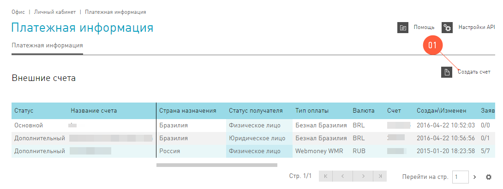

=====================
Финансовая информация
=====================

В разделе :menuselection:`Офис | Финансы и выплаты` находится вся информация, которая затрагивает денежные вопросы работы с вебмастером. Здесь можно контролировать состояние :ref:`внутреннего счета <internal-acc-label>` и видеть свои ежедневные начисления на вкладке  :menuselection:`Финансы и выплаты | История операций`. Вкладка :menuselection:`Финансы и выплаты | Курс валют` ознакомительная, на ней мы публикуем курс валют, по которому проводим расчеты в системе. Здесь есть и :ref:`агентские кабинеты <agent-cabinet-label>`, которые можно использовать, чтобы сотрудничать с внешними рекламными системами.

.. _from-click-to-payout-label:

************************
Путь от клика до выплаты
************************

Итак, если вы начали лить трафик на оффер, то это еще ничего не значит. Вернее, это не значит, что завтра вы получите выплаты за лиды. Все потому, что процесс контроля за ref:`кликами→лидами→действиями <click_lifecycle_label>` не простой. Чтобы гарантировать качество в нашей системе применяется вот такая схема работы с выплатами: 

.. image:: ../../img/account/money_lifecycle.PNG
       :align: center
       :alt: внутренний счет

#. Для начала вебмастер публикует ссылки на своих ресурсах. В **Cтатистике** пока ничего нет. Просто посетители еще не успели заметить рекламные объявления и, соответственно, не кликнули на него.

   .. seealso:: О том как отследить комиссию в интерфейсе. 

#. **Статистика** оживилась, значит, посетители уже во всю просматривают рекламу и совершают какие-то действия. В общем, на этом этапе трафик по офферу у некоторого вебмастера уже есть. Но пока еще нет ни одного *подтверждённого* лида или цели, есть только *открытые*. Все потому, что технически мы можем представлять данные о лидах или целях в режиме «реального времени», а вот проверка этих цифр еще не прошла. То есть эти *открытые* лиды не подтверждены со стороны рекламодателя.
   
   .. attention:: Некоторые рекламодатели передают эти данные с задержкой. Подробнее о :ref:`выгрузке конверсий<conversion-download-label>`.
      
#. **Время одобрения**. Рекламодатель проверяет лиды и цели, все ли было достигнуто и насколько хорошо достигнуто. Примеры некачественных лидов сплошь и рядом: анкета, которую заполнили наполовину или заполнили абракадаброй. Действия, которые рекламодатель отклонит, тоже случаются: например, покупатель отменил доставку товара и ничего не купил, хотя заказал. 
#. **Время оплаты**. Рекламодатель передает нам все свои сверки-проверки и теперь мы можем узнать, какие цели стали *одобренными*, а какие — *отклонёнными*. После проверки рекламодателем лиды и действия переходят из статуса *открытые* в *одобренные* (ну или в *отклоненные*, если что-то пошло не так). И только после всего предыдущего мы начинаем рассчитываться с рекламодателем. Теперь рекламодатель перечисляет деньги за все одобренные цели, а на внутреннем счете вебмастера появляются заработанные деньги.
#. **Холд системы**. Получив данные от рекламодателя, мы начинаем активно работать с этой информацией. Мы проверяем трафик на фрод, это наша задача, которую мы выполняем тщательно.

   .. seealso:: Более подробно о :ref:`выплатах <payout-label>` и :ref:`внешних счетах <external-acc-label>`.

#. И вот, долгожданная дата выплаты. После всех страданий и ожиданий, вебмастер получает :ref:`выплату <payout-label>`. Эта радость происходит по графику выплат, а деньги перечисляются на :ref:`основной внешний счет <external-acc-label>`, который завел вебмастер.

.. _internal-acc-label:

****************
Внутренний счет
****************

.. attention:: Помните, что смена валюты внутреннего счета не бесплатная операция. Взимается 3% комиссия за смену валюты внутреннего счета.

После регистрации в системе для каждого вебмастера создается внутренний счет, на котором хранится вся информация о движении денег этого вебмастера в системе. Именно на внутренний счет поступают заработанные деньги, и с него заработанные деньги выводятся на внешние счета.

У внутреннего счета есть три основные характеристики, которые больше всего влияют на выплаты вебмастера. Узнать их можно в разделе :menuselection:`Офис | Финансы и выплаты | Начисления и выплаты`:

.. image:: ../../img/account/fin_balance.png
       :align: right
       :alt: характеристики внутреннего счета

#. Валюта, в которой система начисляет деньги на внутренний счет. Валюта, в которой вебмастеру начисляются заработанные средства, является основной характеристикой внутреннего счета. Выбрать можно любую из:

   * RUB — российский рубль
   * USD — американский доллар
   * EUR — евро, официальная валюта еврозоны.
   * UAH — украинская гривна
   * KZT — казахстанский тенге
   * CNY — китайский юань
   * BRL — бразильский реал
   * MXN — мексиканское песо
   * MYR — малазийский ринггит
   * PLN — польский злотый

#. _`График выплат`. Вывод средств из системы на внешний счет это, по сути, перечисление заработка вебмастера на его личный счет. Это происходит дважды в месяц, :guilabel:`1го и 16го` числа, без обеда и выходных. Мы называем это *графиком выплат*. Соглашаясь сотрудничать с нами, вебмастер соглашается и на этот график.
#. Холд — индивидуальная настройка, время, в течение которого деньги нельзя вывести. Система проводит проверку трафика.

******************************************
Где узнать состояние внутреннего счета 
******************************************

В разделе :menuselection:`Офис | Финансовая информация | Начисления и выплаты` собрана вся информация о финансовом состоянии аккаунта.

.. figure:: ../../img/account/account_balance.png
       :scale: 100 %
       :align: center
       :alt:  личный счет начисления и выплаты
       
Здесь можно узнать:

#. **Структуру начислений**. На диаграмме показана структура начислений по офферам.
#. **Баланс аккаунта**. В таблице **Баланс аккаунта** содержится информация о состоянии счета вебмастера.
#. **Все операции по счету**. Таблица содержит перечисление :ref:`выплат <payout-label>` на внешние счета вебмастера.

.. _payout-label:

*******
Выплата
*******

Выплаты денег на внешние счета вебмастеров в нашей системе проходят по графику выплат. Чтобы получить деньги, которые вебмастер заработал в системе, нужно выполнить следующие условия:

.. attention:: Если холд системы превышает все разумные пределы (например, 14999 дней), то скорее всего вас забанили. Не пугайтесь, если ваш трафик был чист, то вы сможете решить этот вопрос с техподдержкой |support|_.

#. Зарегистрировать :ref:`внешний счет<external-acc-label>`, куда будут начисляться деньги.
#. Заработать в системе больше 30$.
#. Не быть забаненым. Для этого нужно лить только честный и чистый трафик, который не будет вызывать сомнения у наших экспертов, которые контролируют качество.

.. rubric:: Статусы выплаты

Все выплаты, которые проводятся в нашей системе, проживают несколько состояний до того момента, когда деньги попадают на ваш внешний счет. Эти «состояния» называются **Статусы** и  у каждой выплаты в таблице :menuselection:`Офис | Финансы и выплаты | Начисления и выплаты | Все операции по счету` есть свой статус. Всего в системе три позитивных статуса:

#. **Новая**. Такие выплаты мы только сформировали внутри своей системы и подготовили деньги для перевода.
#. Выплаты со статусом **К оплате** — на середине пути. Процесс перевода денег по этой выплате запущен, но система-получатель еще не подтвердила поступление денег.
#. **Оплачена**. Этот статус говорит о том, что все прошло отлично, деньги переведены на внешний счет и процесс завершен успешно.

На каждом шаге возможна отмена выплаты, тогда в строчке в таблице :menuselection:`Офис | Финансы и выплаты | Начисления и выплаты | Все операции по счету` вы увидите статус **Отклонена**. Не паникуйте, а обращайтесь в техподдержку |support|_. Наши эксперты объяснят вам, в чем проблема и помогут решить все в кратчайшие сроки.

.. _external-acc-label:

*************
Внешние счета
*************

.. attention:: Основным в системе может быть только один внешний счет.

Как только наступает дата выплаты, на внешние счета мы переводим заработанные вебмастером средтсва. К одному аккаунту может быть прикреплено несколько внешних счетов, но плановая выплата будет приходить на тот счет, который вы отметите, как **Основной**. 

Добавить внешний счет
=====================

Внешний счет можно добавить в разделе :menuselection:`Офис | Личный кабинет | Платёжная информация`. Зайдите в раздел и нажмите кнопку :guilabel:`Создать счет`.

.. compound::

       Далее заполните поля в окне **Создание нового счета**:
       
       #. **Название счета**. Называйте счет понятным и удобным для вас именем. Выберите тип счета :guilabel:`Основной`, если хотите, чтобы именно на этот счет поступали плановые выплаты.
       #. **Cтрана бенефициара** — это та страна, в которой зарегистрирован ваш счет.
       #. Выберите **Тип контрагента**: Юридическое лицо, Индивидуальный предприниматель, Физическое лицо.
       #. Выберите платежную систему. Вы можете зарегистрировать счета следующих платежных систем:
       
          #. WebMoney
          #. PayPal
          #. Яндекс.Деньги
          #. Банковский счет
       
       #. Далее выберите валюту вашего внешнего счета. В этой валюте будут перечисляться деньги на ваш внешний счет.
       #. **Реквизиты счета** заполните так, чтобы по пути к вам деньги не потерялись.
       #. Далее система предложит вам подтвердить создание внешнего счета по СМС. Будьте внимательны, вводя номер телефона, потому что исправить его можно толлько через нашу техподдержку |support|_.

Выплаты на банковские счета
===========================

Мы работаем над этим разделом. Скоро вы сможете его прочитать.

Налоги
======

Мы работаем над этим разделом. Скоро вы сможете его прочитать.
