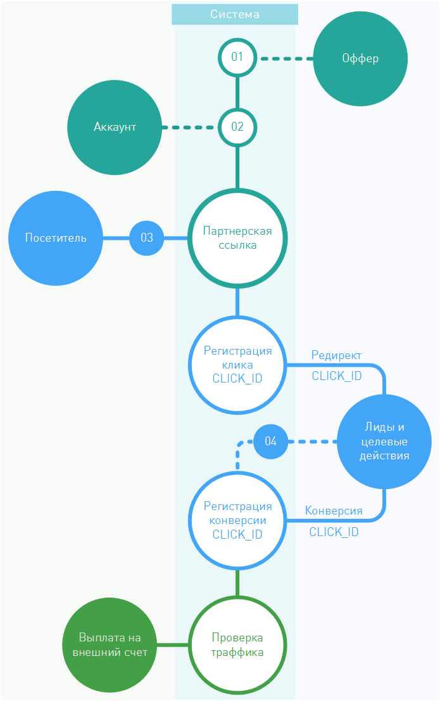
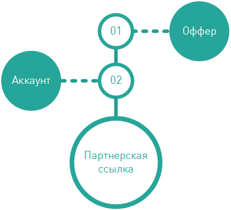

====================
Как все это работает
====================

Что такое партнерство в интернет-маркетинге, все более или менее себе представляют. Но как технически в сети реализована «слежка» за действиями посетителя? Почему клики не теряются? И как рекламодатель узнает, откуда приходит посетитель, кому выплачивать благодарность? 

Все эти сложные и интересные вещи можно изучать полжизни, но мы постараемся вкратце рассказать, как работает наша партнерская сеть с технической точки зрения.

.. rubric:: Подготовка к работе

Для начала надо выполнить предварительные условия для генерации партнерской ссылки:

#. В первую очередь рекламодатель публикует свое рекламное предложение в партнерской сети.
#. Любой вебмастер может стать партнером такого рекламодателя, используя партнерскую сеть, но для этого ему нужно создать аккаунт в этой сети и получить партнерскую ссылку.

После вебмастер должен опубликовать ссылку на своих ресурсах и налить на нее траффика.

.. rubric:: Работа с партнерской сетью

По клику на партнерскую ссылку посетитель переправляется на сайт рекламодателя, но, незаметно для посетителя, происходит немного web-магии, которая очень важна для всех участников интернет-маркетинга.

Эта магия заключается в том, что, перед тем как попасть на сайт рекламодателя, запрос посетителя проходит сначала через партнерку и только потом, с помощью механизма редиректа, переправляется уже по назначению.

Самое важное, из-за чего посетителю надо отметиться в партнерке, это параметр, которым система помечает каждый клик, некоторый :code:`click_ID`. Этот параметр позволит:

#. Зарегистрировать клик в системе. Потом можно узнать, сколько было всего кликов, анализировать статистику и строить прогнозы.
#. Проследить жизнь клика на стороне рекламодателя. Этот параметр партнерка передает рекламодателю, и он его возвращает позже — с конверсией.
#. Однозначно определить вебмастра, которому нужно выплатить комиссию и ничего не потерять по дороге.

Когда система присвоила клику посетителя :code:`click_ID`, тот благополучно переправляется к рекламодателю и там совершает действия, в которых заинтересованы все. По достижении целей, система рекламодателя оправляет в партнерку уведомление о уже случившейся конверсии (к которой однозначно прикреплен :code:`click_ID`, не забываем). 

-------------------------------------------------------------------------------------------------------------------

.. rubric:: Выгрузки конверсий

.. tip::

   Например, в интернет-магазине покупатель совершил покупку, то есть собрал корзину и нажал на кнопку Оплатить, и рекламодатель уже собирает посылку… Но переведённые деньги зависли между двумя банками, а дойдут до продавца они только дня через три. Такие задержки очень распространены, их нельзя не учесть.

Бывает часто, что рекламодатель не может технически сообщать о конверсии в тот момент, когда она совершается. Причины могут быть самые разные, но чаще всего партнерская сеть и рекламодатель договариваются о сроке, который удовлетворит интересы вебмастеров и позволит управлять рисками рекламодателя. И, когда наступит срок, рекламодатель обязан передать информацию о всех заказах и конверсиях в партнерскую сеть. Такую «передачу» мы называем выгрузкой.

Если партнерская сеть и рекламодатель работают по схеме с выгрузкой, то, логично, что информация о конверсиях вебмастера появляется с задержкой ровно на срок, за который бывает выгрузка. Такие подробности о работе можно уточнять в техподдержке.

-----------------------------------------------------------------------------------------------------------------------

После того, как конверсия зарегистрирована в партнерской сети, пройдет проверка траффика на чистоту и честность, за это отвевает партнерка перед рекламодателем. Ну и дальше, все происходит по благополучным сценариям: приходит дата выплаты, а с ней и сама выплата за все конверсии на внешний счет вебмастера.

******************
Партнерские ссылки
******************

Партнерская ссылка это то, зачем вебмастер регистрируется в партнерской сети. Именно она позволит ему перенаправлять посетителя своего ресурса на сайт рекламодателя после клика по рекламе. 

Партнерская ссылка жестко связана с двумя объектами в системе и без них существовать не может: определенный :term:`оффер`, зарегистрированный в системе, и определенный вебмастер, зарегистрированный в системе. Это работает и “с другой стороны”: система по партнерской ссылке может безошибочно определить, чья это ссылка и на какой оффер она ведет.

Партнерская ссылка, в общем случае, выглядит вот так: :code:`https://<partner’s_domain>/<some_code>`

В ней параметр :code:`<partner’s_domain>` это не адрес рекламодателя, а всегда адрес партнерской сети. То есть, по клику на ссылку посетитель вашего ресурса на самом деле переправляется на сервера партнерки.

.. seealso:: Зачем и почему мы рассказывали ранее.

Это нужно, чтобы зарегистрировать этот клик на стороне партнерки  → чтобы контролировать конверсии по этому клику → чтобы потом выплачивать комиссии вебмастеру.

Где найти партнерские ссылки
============================

Мы работаем над этим разделом. Скоро вы сможете его прочитать.

Deep link
=========

Партнерские ссылки ведут на сайт рекламодателя. Все верно, но куда конкретно? Ведь на сайтах тысячи страниц. Чаще всего, в условиях оффера рекламодатель не утруждается перечислять все урлы своего сайта, а дает просто точку входа — основной лендинг. Обычно, это домашняя страница сайта.

Целевая ссылка или, как еще ее называют Deep link, — партнерская ссылка, но она ведет не на домашнюю страницу, а на ту, которая находится где-то глубже (англ. deep) внутри сайта. Обычно диплинки генерируются в интерфейсе партнерской сети, но куда они будут вести - выбирает сам вебмастер.

Как сгенерировать Deep link
===========================

Мы работаем над этим разделом. Скоро вы сможете его прочитать.

.. |02| image:: ../../img/start/01.png
   :scale: 65 %

