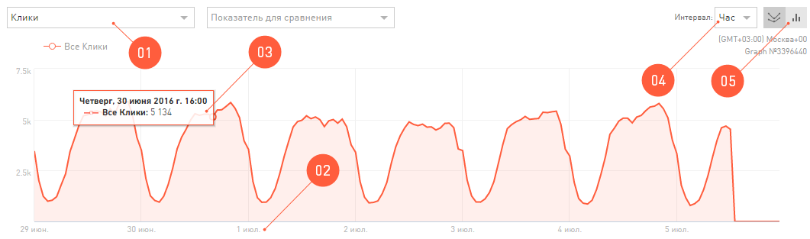
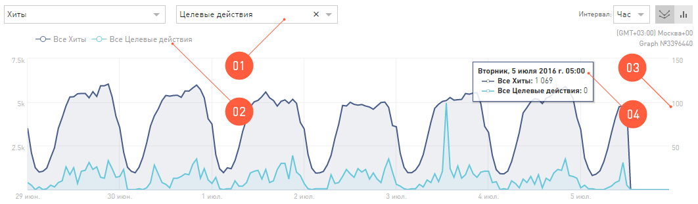
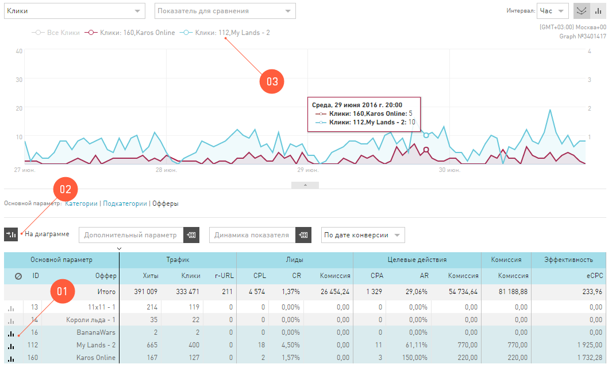

=================
Работа с Графиком
=================

График — это тот же самый отчет из таблицы, только мы его вывели на координатную плоскость, чтобы вам было удобно его анализировать.
С настройками по умолчанию, график выглядит вот так:

 
В зоне **Графика** есть дополнительные функции для работы и настройки внешнего вида:

      #. Показатель для вывода на график. В зависимости от отчета вы можете выбрать любой показатель, чтобы он был отрисован на графике.
      #. График всегда строится как функция количества (например, лидов или кликов) от времени.
      #. Но параметр времени можно изменить, чтобы посмотреть динамику основного показателя не по дням, а, например, по неделям. Обратите внимание, что, выбрав в календаре очень короткий период – до 10 дней, вы сможете просмотреть статистику по часам, но зато статистика по неделям вам будет недоступна.
      #. Внешний вид графика можно изменить на столбчатые диаграммы.
      #. Всплывающая подсказка, которая содержит подробности с конкретными цифрами, появляется при наведении курсора на точку на графике.
      #. Вы можете скрыть график, если он вам надоел.

********************************************
Сравнение двух разных показателей на графике
********************************************

На график в **Статистике** можно вывести две функции от времени. То есть, просматривать динамику двух разных показателей в течение выбранного периода в Календаре. 

 
1. Чтобы сравнить два графика по разным показателям, надо выбрать Показатель для сравнения.
2. Его масштаб будет отличаться от первой функции на графике, поэтому мы вывели еще одну шкалу справа.
3. Кликнув на название показателя в легенде графика, можно скрыть его отрисовку.
4. Если навести курсор на точку на графиках всплывет подробная подсказка.

.. _additional_param_label:

************************************
Дополнительные показатели на графике
************************************

На график можно добавить уточняющий график из таблицы отчета, который вы в данный момент просматриваете.

.. tip:: Например, вы смотрите отчет по офферам, и на график выводятся **Лиды**. То, что вы видите на графике, это сумма всех лидов по ссылкам всех офферов. В **Статистике** на график вы можете вывести лиды по отдельным офферам.

Предположим, вы в данный момент просматриваете отчет на графике. Тот показатель, который выводится на график в качестве основного, это *суммарный* показатель. Этот *суммарный* график можно проанализировать по *слагаемым*, то есть вывести на координатную плоскость *составные части*.

Как вывести составные части на график
=====================================

 
1. Выберите в таблице отчета максимум три показателя, которые хотите вывести на график.
2. Нажмите **На диаграмме**.
3. Все данные, которые выводятся на график, перечислены в легенде графика.
