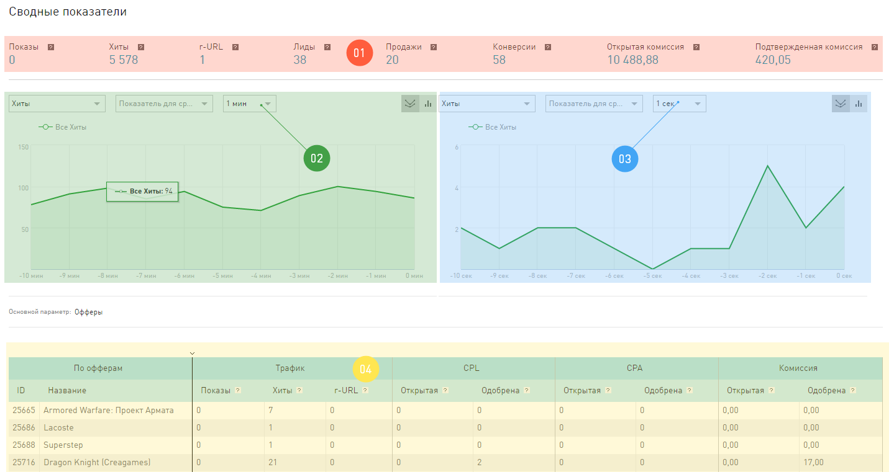

======================
Внешний вид Статистики
======================

Как известно, кто владеет информацией, тот владеет всем. Самая ценная информация в интернет-маркетинге, это актуальные цифры о том, что происходит с траффиком. Мы предоставляем мощный инструмент для анализа вашего траффика, то есть вашей работы, – отчеты в разделе **Статистики**. Эта информация поможет вам своевременно находить проблемы, принимать правильные решения.

Все отчеты в **Статистике** зависятот времени,  за которое вы хотите увидеть данные. Обратите внимание, что Статистика живет только в двух часовых поясах:

* Москва (GMT+3)
* Сан-Паулу (GMT-3)

.. seealso:: Где настроить :ref:`часовой пояс <account-settings-label>`. 
 
Это значит, что выдается статистика по этим двум часовым поясам. Если у вас в настройках аккаунта указано время, отличное от Москвы или Сан-Паулу, то ваша статистика будет, по умолчанию, жить по московскому времени.

.. rubric:: Как ориентироваться в статистике

.. figure:: ../../img/statistics/overview.png
   :scale: 100 %
   :align: center
   :alt: Обзор интерфейса Статистики
 
Интерфейс **Статистики**, для удобства, разделен на «зоны ответственности»:

#. **Поиск** по отчетам. Поможет быстро найти интересующий в дереве отчетов в Статистике.

#. **Навигация** по отчетам. Здесь перечислены все варианты отчетов, которые выдает **Статистика**. Как видите, это огромный список – огромные возможности.

#. Панель **Скинов**. Скины это дополнительные фильтры на статистику по бизнес-направлениям. Скин **Игры** выдает статистику только по онлайн играм, а скин **Финансы** – только по финансовой вертикали. Скины ограничивают данные по всем отчетам, в зависимости от того, какое бизнес-направление вам интересно.

#. Зона «первой помощи». Здесь расположены кнопки доступа к документации и вспомогательные функции: **Экспорт отчета в .xls** и **Сохранить настроенный фильтр**.

#. Фильтр, в котором вы настраиваете правила для построения отчета. Он отличается от других фильтров в нашем интерфейсе только тем, как вы сохраняете настроенный набор фильтров — кнопка Сохранить фильтр расположена выше, в зоне “первой помощи”

#. **График**. Это отчет, показанный в виде картинки. Тут же есть элементы, которыми вы настраиваете свой график.

#. Собственно, сам **Отчет**. В виде таблицы выводится вся информация, которую вы запросили. Тут же есть элементы, которыми вы настраиваете свой отчет.

*************************
Отчеты В реальном времени
*************************

Их можно найти в **Статистике**, на панели навигации, в группе **Стандартные отчеты**.

Эти отчёты показывают статистику без задержек. Как только информация о хите/клике/лиде появляется в нашей системе, мы сразу публикуем ее для пользователей в этих отчетах.

Отчеты этой группы отличаются от остальных тем, что данные в них поступают постоянно, и обновляется страница с отчетом сама, без дополнительных действий вебмастера. И еще на странице будет два графика, а не один, потому что мы выводим свежую статистику по траффику вебмастера с задержкой в минуту и *очень* свежую статистику с задержкой всего в секунду.

 
Открыв отчеты **В реальном времени**, вы увидите интерфейс, который обновляется не синхронно, а по зонам:

1. **Сводные показатели** показывают данные за прошедший час. Отсчет начинается с того момента, как вы зашли на страницу этого отчета.
2. **Статистика по минутам**, обновляется по тому расписанию, которые вы укажете для нее. Расписание над графиком.
3. **Статистика по секундам**, обновляется по другому расписанию, вы тоже его можете выбрать. Расписание над графиком.
4. **Таблица отчета**, обновляется независимо от других зон на странице, по собственному расписанию, которые вы выбираете над таблицей. И еще, обратите внимание, что эта статистика не накапливается, а выдается за тот период, который вы выберете.

В реальном времени можно получить:

* **Отчет по офферам**, где траффик будет сгруппирован по тем офферам, с которыми вы работаете.
* **Отчет по периодам**, траффик группируется в таблице по 1 минуте в течение последнего часа.
