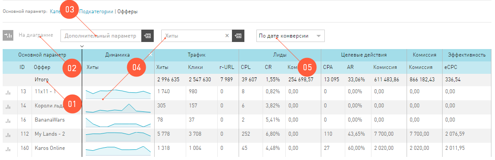

==============
Таблица отчета
==============

Основная информация, которую предоставляет **Статистика**, выводится в таблице. Основной параметр в таблице – это тот параметр, который выведен в заголовок отчета. 

Таблица в **Статистике** настраивается так же, как и любая другая таблица в интерфейсе. Но у таблицы отчета в **Статистике** есть и дополнительные функции:

#. Параметр из отчета можно вывести на график. Подробности :ref:`здесь <additional-param-label>`.
#. Группировка по **Дополнительному параметру**. Выбрав любой из доступных **Дополнительных параметров**, вы получите отчет, который будет выводить в таблицу дополнительный параметр, как признак у основного параметра.
#. Упрощенная **Динамика показателя**. Динамика показателя – виджет, который можно добавить в таблицу отчета, выбрав показатель в выпадающем списке, расположенном над таблицей отчета. Динамика представляет собой график выбранного показателя за последние 10 дней (вне зависимости от выбранного периода).  

   .. figure:: ../../img/statistics/table_dynamics.png
      :scale: 65 %
      :align: center
      :alt: таблица статистики, динамика показателя

#. Фильтр по ключевым словам. Введя ключевое слово и нажав Enter, вы получите отсортированный по вашим ключевым словам отчет.
#. Перегруппировать данные по разным датам:

   #. Клик — для всех событий будет учитываться дата первого клика посетителя по рекламной ссылке.
   #. Конверсия —  для всех событий будет учитываться дата конверсии, т.е достижения цели.
   #. Загрузка — для всех событий будет учитываться дата регистрации события в нашей партнерской сети.
